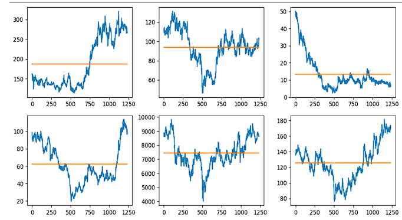

# MOSAIC ‘24: Stock Close Price Prediction

## Task Description

Our task is to predict the stock close price for the upcoming 96 days for all six companies from the given data. The dataset comprises the following columns (excluding the index column):

- Open: The starting price of a stock on a particular day.
- High: The highest price the stock reaches during that day.
- Low: The lowest price the stock drops to during that day.
- Volume: The total number of shares traded within that day indicating market activity.
- Close: The final price of the stock at the end of the trading day.
- Adjusted Close: This considers factors like dividends and stock splits to give a more accurate picture of the stock's value.
- Company: The name of the company.

## Analysis of the Dataset

Exploratory Data Analysis (EDA) was conducted to gain insights into the dataset's structure, distribution, and relationships among variables.

- Multicollinearity Check: Correlations between Open, High, Low, Close, and Volume stock prices for six companies were analyzed through heatmaps, revealing strong interdependencies. To mitigate multicollinearity, Open, High, and Low price columns were dropped, streamlining the dataset for further analysis.
- Closing Price Analysis: Null values in the dataset were checked using df_closing.info(). Subplots visualized the closing prices of six companies plotted against day number, aiding in examining market trends and performance.
- Variation Analysis: The closing prices were plotted against time with a horizontal line representing the mean closing price across all companies, aiding in comparing individual company trends to overall market behavior.

- Outlier Detection: Boxplots illustrated the central tendency, spread, and variability of closing prices over different years for each company, aiding in trend analysis and outlier detection. The impact of outliers was found to be negligible.

## Our Approach

Based on the dataset analysis, we pre-processed the data by:

1. Keeping only the close_price of each company.
2. Separating the close_price based on the company due to the time series nature of the forecasting.
3. Checking for and handling missing values.

We then split the data into X and y, where X is a 2D array containing n_lookback elements up to the whole close column, and y contains n_forecast elements. The dimensions are:
- X: \[n_lookback, n-n_lookback+1\]
- y: \[n_forecast, n-n_lookback+1\]

### Model Implementation

We implemented a neural model with the following architecture:

1. Layers: 3 LSTM layers followed by 3 Dense layers, decreasing output shape until it reached the final y.shape.
2. Activation Function: Leaky ReLU.
3. Optimizer: Adam, for better and faster descent.

This final model was reached after several iterations of training and hyperparameter tuning to minimize validation error.

## Predictions

The output for the 96 days is judged under the RMSE (root mean squared error) between the actual close prices and predicted closing prices.

- Public Score: 90.6748
- Private Score: 255.2538

## Shortcomings of Our Approach

1. Limited Feature Set: Focusing solely on past stock prices neglects potentially valuable information from other relevant factors.
2. Data Dependence: LSTM models are highly dependent on the quality and quantity of historical data.
3. Overfitting: LSTM models are prone to overfitting, especially with limited data.
4. Complexity and Computational Cost: LSTM models require significant computational resources.
5. Limited Interpretability: LSTM models can be challenging to interpret.
6. Assumption of Stationarity: LSTM models assume stationary data, which may not be the case with financial time series.
7. Limited Forecast Horizon: LSTM models are generally better suited for short to medium-term forecasting.
8. Sensitivity to Hyperparameters: LSTM models require careful tuning of hyperparameters.

## Future Scope and Further Improvement

1. Feature Engineering: Incorporate additional data such as trading volume, market sentiment, and macroeconomic indicators.
2. Hyperparameter Tuning: Experiment with different hyperparameters of the LSTM model.
3. Model Architecture: Explore alternative neural network architectures beyond LSTM.
4. Ensemble Methods: Combine predictions from multiple models to improve overall performance.
5. Data Preprocessing: Ensure proper data scaling, normalization, and cleaning.
6. Regularization: Implement regularization techniques to prevent overfitting.
7. Sequential Patterns: Investigate specific sequential patterns or dependencies in the data.
8. Model Interpretability: Enhance interpretability using techniques like attention mechanisms.
9. Data Augmentation: Use techniques like time-series data augmentation to increase dataset diversity.
10. Deployment and Monitoring: Develop a robust deployment pipeline and continuously monitor model performance.

